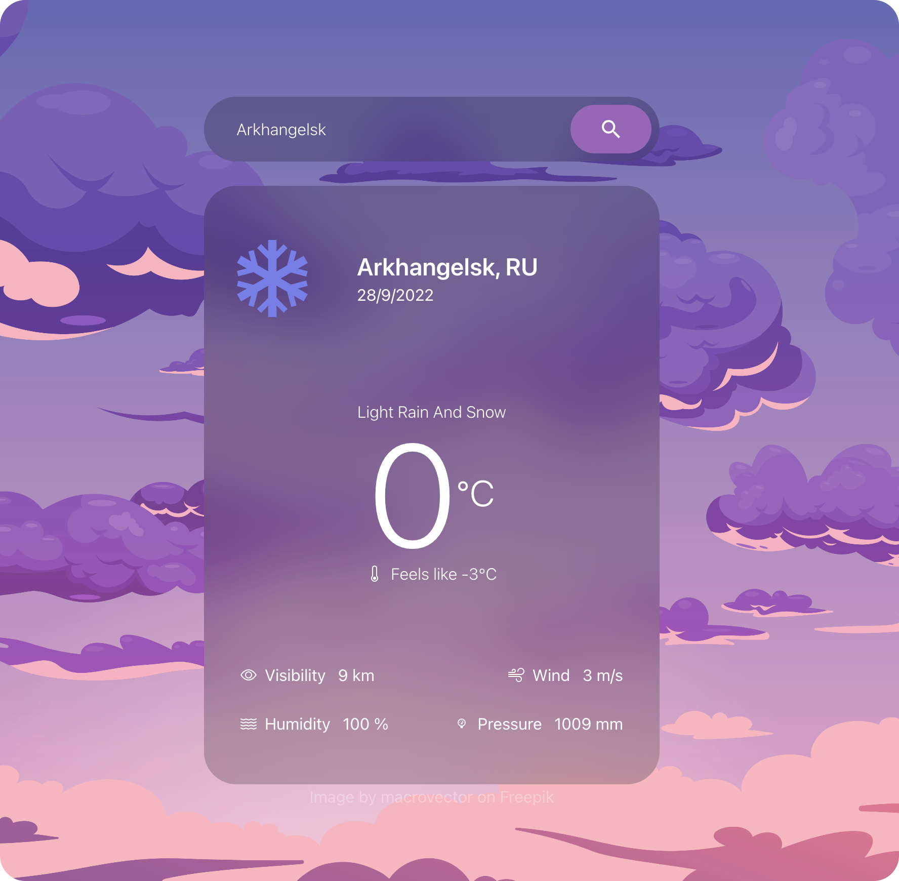

# MyWeatherApp
 My education project to learn TypeScript, React/Redux, Tailwindcss
 ## Implemented:
 * Api calls by city name and by coodinates
 * Error and Loading states
 * Relative weather icons
# Screenshot

